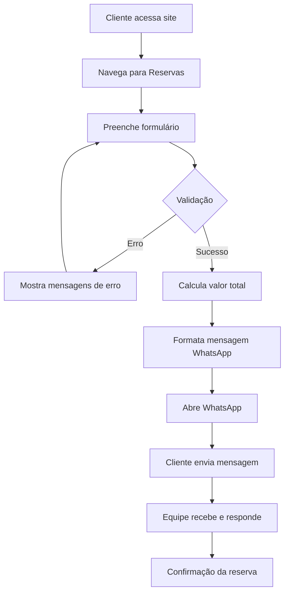

# 📅 Sistema de Reservas - Tranquilidade Boat

## ✅ Implementado em: 22/11/2024

---

## 🎯 Funcionalidades

### Formulário de Reserva Completo
- ✅ **Validação robusta** com Zod e React Hook Form
- ✅ **Campos obrigatórios**: Nome, Email, Telefone, Passeio, Data, Número de Pessoas
- ✅ **Campos opcionais**: Observações/Solicitações Especiais
- ✅ **Seleção de Data** com calendário interativo (react-day-picker)
- ✅ **Cálculo automático** do valor total baseado no passeio e número de pessoas
- ✅ **Integração WhatsApp** - Envia reserva formatada direto para o WhatsApp Business

### Validações Implementadas
```typescript
- Nome: mínimo 3 caracteres
- Email: validação de formato
- Telefone: formato brasileiro com regex
- Passeio: obrigatório (select dos passeios ativos)
- Data: não permite datas passadas
- Número de Pessoas: mínimo 1, máximo 20
```

### Experiência do Usuário
- ✅ **Feedback visual** com toasts de sucesso/erro
- ✅ **Mensagens de validação** em tempo real
- ✅ **Loading states** durante processamento
- ✅ **Reset automático** do formulário após envio
- ✅ **Design responsivo** para mobile e desktop

---

## 📁 Arquivos Criados

```
/src/components/landing/
├── BookingForm.tsx        # Formulário de reserva com validação
└── BookingSection.tsx     # Seção da landing page
```

### BookingForm.tsx
Componente principal com:
- React Hook Form para gerenciamento de estado
- Zod para validação de schema
- Integração com componentes shadcn/ui
- Formatação de mensagem para WhatsApp
- Toast notifications

### BookingSection.tsx
Seção da landing page que inclui:
- Header da seção
- Formulário de reserva
- Cards informativos (resposta rápida, segurança, atendimento)
- Link direto para WhatsApp

---

## 🔗 Integração na Landing Page

### Header Atualizado
Adicionado link "Reservar" no menu de navegação:
- ✅ Desktop menu
- ✅ Mobile menu
- ✅ Scroll suave para seção

### Ordem das Seções
```
1. Hero
2. Passeios (ToursSection)
3. Widgets (Clima + Marés)
4. ✨ RESERVAS ← NOVA SEÇÃO
5. Como Funciona
6. Por Que Escolher
7. FAQ
8. Footer
```

---

## 💬 Integração WhatsApp

### Formato da Mensagem
```
🚤 *NOVA RESERVA - Tranquilidade Boat*

👤 *Cliente:* [Nome]
📧 *Email:* [Email]
📱 *Telefone:* [Telefone]

🌊 *Passeio:* [Nome do Passeio]
📅 *Data:* [Data formatada]
👥 *Pessoas:* [Número]
💰 *Valor Total:* R$ [Valor calculado]

📝 *Observações:* [Se houver]

_Enviado via formulário do site_
```

### Como Funciona
1. Usuário preenche formulário
2. Validação em tempo real
3. Ao clicar "Solicitar Reserva"
4. Mensagem formatada é gerada
5. WhatsApp abre com mensagem pronta
6. Cliente envia e aguarda confirmação

### Configurar Número do WhatsApp
**IMPORTANTE**: Atualizar o número em 2 locais:

**1. BookingForm.tsx (linha ~106)**
```typescript
const whatsappNumber = '5583999999999'; // SUBSTITUIR
```

**2. BookingSection.tsx (linha ~61)**
```typescript
href="https://wa.me/5583999999999"
```

**Formato**: `55` (Brasil) + `83` (DDD) + `999999999` (número)

---

## 🎨 Design e UX

### Componentes Shadcn/UI Utilizados
- `Form` - Gerenciamento de formulário
- `Input` - Campos de texto
- `Select` - Seleção de passeio
- `Calendar` - Seletor de data
- `Popover` - Container do calendário
- `Textarea` - Observações
- `Button` - Ações
- `Toast` - Notificações

### Responsividade
- Grid 2 colunas em desktop
- 1 coluna em mobile
- Calendário otimizado para mobile
- Menu mobile com link de reservas

### Acessibilidade
- Labels descritivos
- Mensagens de erro claras
- Feedback visual e textual
- Navegação por teclado

---

## 🧪 Como Testar

### 1. Acesse a seção de Reservas
```
http://localhost:8080 → Clique em "Reservar" no menu
ou
Scroll até a seção "Faça sua Reserva"
```

### 2. Preencha o formulário
- Nome: mínimo 3 caracteres
- Email: formato válido
- Telefone: formato brasileiro
- Passeio: selecione um dos 3
- Data: escolha data futura
- Pessoas: 1-20
- Observações: opcional

### 3. Teste Validações
- Deixe campos vazios → Mensagens de erro
- Email inválido → Erro específico
- Data passada → Bloqueado
- Telefone inválido → Erro de formato

### 4. Envio
- Preencha tudo corretamente
- Clique em "Solicitar Reserva via WhatsApp"
- WhatsApp abre com mensagem formatada
- Toast de sucesso aparece
- Formulário reseta após 2s

---

## 🔄 Fluxo de Reserva



---

## 📊 Dados Capturados

### Informações do Cliente
- Nome completo
- Email
- Telefone/WhatsApp

### Detalhes da Reserva
- Passeio selecionado
- Data desejada
- Número de pessoas
- Valor total (calculado)
- Observações especiais

---

## 🚀 Próximas Melhorias (Opcionais)

### Backend (Futuro)
- [ ] Salvar reservas em banco de dados
- [ ] Envio automático de confirmação por email
- [ ] Sistema de disponibilidade em tempo real
- [ ] Integração com gateway de pagamento
- [ ] Dashboard administrativo para gerenciar reservas

### Frontend
- [ ] Verificação de disponibilidade antes do envio
- [ ] Sugestão de datas com marés ideais
- [ ] Upload de documentos (CPF para contrato)
- [ ] Seleção de extras (almoço, bebidas, etc)
- [ ] Cupom de desconto

### Automação
- [ ] Chatbot de atendimento inicial
- [ ] Lembretes automáticos (1 dia antes)
- [ ] Follow-up pós-passeio
- [ ] Sistema de avaliações

---

## 💡 Dicas de Uso

### Para o Cliente
1. Preencha todos os campos corretamente
2. Use o telefone que tem WhatsApp
3. Escolha datas com antecedência
4. Informe necessidades especiais em "Observações"
5. Aguarde confirmação via WhatsApp

### Para a Equipe
1. Configure o número do WhatsApp correto
2. Mantenha atendimento ágil (até 2h)
3. Confirme disponibilidade da data
4. Envie detalhes de pagamento
5. Confirme 1 dia antes do passeio

---

## 🔐 Segurança

- ✅ Validação no frontend (Zod)
- ✅ Sanitização de dados
- ✅ Não armazena dados sensíveis no localStorage
- ✅ Comunicação direta via WhatsApp (criptografado)
- ⚠️ **Para produção**: Implementar validação backend

---

## 📱 Contato via WhatsApp

### Link Direto
```
https://wa.me/5583999999999?text=Olá!%20Gostaria%20de%20agendar%20um%20passeio
```

### Formato da Mensagem Automatizada
- Emoji para categorização
- Markdown para formatação
- Dados estruturados
- Origem identificada (site)

---

## ✅ Checklist de Deploy

Antes de colocar em produção:

- [ ] Atualizar número do WhatsApp em `BookingForm.tsx`
- [ ] Atualizar número do WhatsApp em `BookingSection.tsx`
- [ ] Atualizar número do WhatsApp em `Header.tsx`
- [ ] Testar formulário em diferentes dispositivos
- [ ] Testar validações
- [ ] Testar envio para WhatsApp
- [ ] Verificar responsividade mobile
- [ ] Verificar acessibilidade (teclado, screen readers)
- [ ] Configurar Google Analytics para tracking de conversões
- [ ] Adicionar Meta Pixel (Facebook/Instagram Ads)

---

**Status**: ✅ Pronto para uso!
**Versão**: 1.0
**Última atualização**: 22/11/2024
